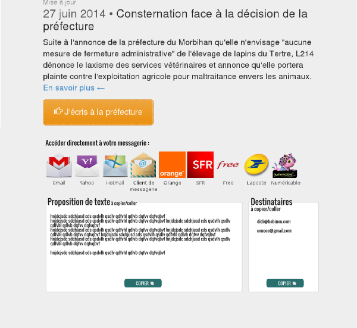

# MailSender
	* This class will help you redirect your users to their favorite webmails in just one click. If it's possible, it will also autocomplete the to, bcc, cc, subject & body fields to ease the sending for the user.

## Roadmap

### Version 1 : simple, fast and functional
	* without complex things like use of APIs

### Webmails specificities
	* Hotmail : BCC can't be autocompleted with URL parameter
	* Yahoo : subject can't be autocompleted with URL parameter; only one email adress per field can be passed with the 		URL parameters (emails seperation is done with JS so semicolons won't work)
	* Free : body can't be autocompleted with URL parameter
	* Orange, SFR, Laposte won't take any URL parameter
	

#### Misc info
        * Get requests characters limitations by webmail :
        * Windows Live Hotmail : ~1750 chars
        * Gmail : ~1900 chars
        * Yahoo Mail : ~7000 chars
        * Client : ~1500 chars
        * (limitations are after url encoding)
        
        * Mail clients statistics for France pop :
        * 1 - Orange => ~27%
        * 2 - Hotmail/Outlook => ~19%
        * 3 - Gmail => ~19%
        * 4 - SFR => ~11%
        * 5 - Yahoo => ~11%
        *
        * Source : http://www.journaldunet.com/ebusiness/le-net/classement-services-mail/
        
        * For mobile supports, only the client link will be displayed.
